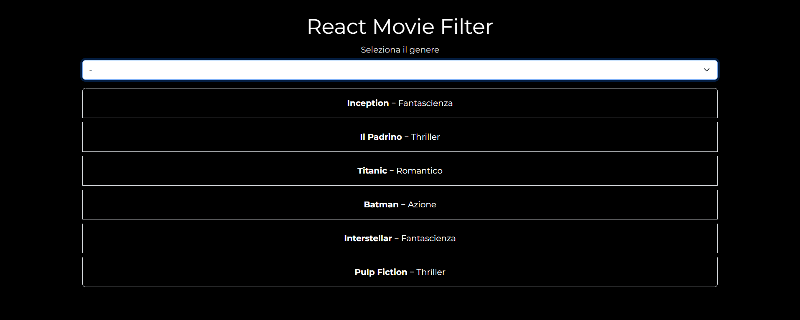
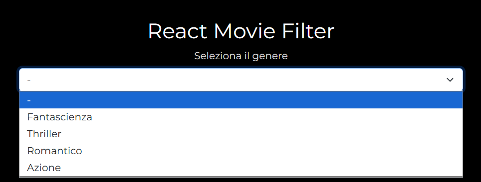

# react-movie-filter

## 🇬🇧 English Version

### Overview

React exercise focused on creating a dynamic movie filter using state management and the `useEffect` hook, based on movie genres.

### Assignment Summary

The assignment required to:

- Create a new React project.
- Start from a predefined array of movie objects, each containing a `title` and `genre`:
  - Inception – Fantascienza
  - Il Padrino – Thriller
  - Titanic – Romantico
  - Batman – Azione
  - Interstellar – Fantascienza
  - Pulp Fiction – Thriller
- Implement a genre filter using React state and `useEffect` to manage dynamic updates.
- Use a `<select>` input to allow the user to choose a genre and display only the movies matching the selected genre.
- Ensure that when no genre is selected, all movies are shown.
- Prioritize the filtering logic and state handling before working on styling.

---

## 🇮🇹 Versione Italiana

### Panoramica

Esercizio React dedicato alla creazione di un sistema di filtro per una lista di film basato sul genere, utilizzando lo stato e l’hook `useEffect`.

### Riassunto della Consegna

La consegna richiedeva di:

- Creare un nuovo progetto React.
- Utilizzare un array predefinito di oggetti film, ciascuno con `title` e `genre`:
  - Inception – Fantascienza
  - Il Padrino – Thriller
  - Titanic – Romantico
  - Batman – Azione
  - Interstellar – Fantascienza
  - Pulp Fiction – Thriller
- Implementare un filtro per genere sfruttando lo stato di React e `useEffect` per gestire il filtraggio dinamico.
- Aggiungere una select che permetta all’utente di scegliere un genere e mostrare solo i film corrispondenti.
- Fare in modo che, se non viene selezionato alcun genere, vengano visualizzati tutti i film.
- Dare priorità alla logica di filtraggio e alla gestione dello stato, rimandando le scelte di stile grafico a un secondo momento.
